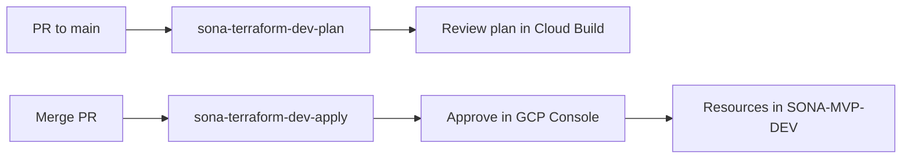

# MVP infrastructure bootstrap (uk/dev)

End-to-end path for **core GCP** only — no GKE/GPU until phase 2.

**Deploy path:** GitHub PR → Cloud Build plan → merge `main` → **approve** apply trigger. No `gcloud builds submit`.  
**Human-only steps:** [`BOOTSTRAP-MANUAL-STEPS.md`](BOOTSTRAP-MANUAL-STEPS.md).

## What gets deployed (phase 1)

| Component | Purpose |
|-----------|---------|
| VPC + VPC connector | Private Cloud SQL + future Cloud Run |
| Cloud SQL (PostgreSQL 16) | App database (`ENTERPRISE` + `db-f1-micro`) |
| KMS + CMEK buckets | Exports + model storage |
| Secret Manager | DB password |
| Artifact Registry | Future app + vLLM images |
| Cloud Tasks | Async LLM jobs queue |
| Runtime SA | Cloud Run identity |

**Not in phase 1:** GKE, vLLM, GPU (`inference_enabled = false`).

## CI/CD flow



1. Open PR → **plan** runs automatically (`sona-terraform-dev-plan`).
2. Merge to `main` → **apply** trigger starts, waits for **approval**.
3. [Cloud Build → History](https://console.cloud.google.com/cloud-build/builds;region=europe-west2?project=1055416779632) → approve `sona-terraform-dev-apply`.
4. First apply takes **~15–30 min** (Cloud SQL private IP is slow).

Ensure `sen/infra` (or `main`) includes Terraform fixes: VPC connector `min_instances`/`max_instances`, Cloud SQL `db_edition = "ENTERPRISE"`. Sync live triggers after merge:

```powershell
.\infra\scripts\setup-cloud-build.ps1 -SkipBootstrap -UpdateTriggers
```

## Phase 2 (inference)

When ready:

1. Request **L4 GPU quota** in `europe-west2-b` (manual — see BOOTSTRAP-MANUAL-STEPS).
2. Upload Gemma weights to the models bucket.
3. Mirror `vllm/vllm-openai` to Artifact Registry.
4. Set `_INFERENCE_ENABLED=true` on apply trigger and `inference_enabled = true` in tfvars.
5. Merge + approve apply.

## Outputs after apply

```bash
cd infra/terraform/environments/uk/dev
terraform output
```

Key values: `cloud_sql_instance_connection_name`, `runtime_service_account_email`, `exports_bucket_name`, `models_bucket_name`.
