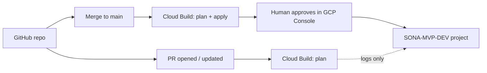

# GitHub → Cloud Build → Terraform (recommended)

**Source of truth:** GitHub (this repo).  
**Executor:** [Cloud Build](https://cloud.google.com/build/docs) in your GCP project — Google’s standard way to run IaC from a connected repository.  
**Approval:** Cloud Build **build approvals** on the **apply** trigger so infrastructure changes are not applied until a human approves in Google Cloud.

We do **not** use GitHub Actions to apply Terraform in this layout (no long-lived GCP keys in GitHub). GitHub only stores the artifacts; Google pulls them and runs the pipeline.

Canonical project ids live in [`../gcp-projects.yaml`](../gcp-projects.yaml).

---

## Dev project (configured today)

| Field | Value |
|-------|--------|
| Display name | SONA-MVP-DEV |
| **Project ID** | `project-a625d19b-de99-48e9-9a9` |
| Project number | `1055416779632` |
| **Jurisdiction** | `uk` |
| Region | `europe-west2` |
| Terraform root | `infra/terraform/environments/uk/dev` |
| Terraform state bucket | `project-a625d19b-de99-48e9-9a9-terraform-state` |
| State prefix | `sona/uk/dev` |
| Default Cloud Build SA | `1055416779632@cloudbuild.gserviceaccount.com` |

Stage and prod: add rows to `gcp-projects.yaml` when those projects exist, then duplicate triggers with new substitutions.

---

## Pipeline layout (two triggers)

| Trigger | Config file | When it runs | Applies infra? |
|---------|-------------|--------------|----------------|
| **sona-terraform-dev-plan** | [`cloudbuild.terraform.plan.yaml`](cloudbuild.terraform.plan.yaml) | Pull request to `main`, or push to any branch (your choice) | **No** — `terraform plan` only |
| **sona-terraform-dev-apply** | [`cloudbuild.terraform.apply.yaml`](cloudbuild.terraform.apply.yaml) | Push to `main` (after merge) | **Yes** — after **approval** |



---

## One-time setup in GCP (dev)

Run these once per project (from a machine with `gcloud` and **Owner** on the project).

### 1. Point gcloud at dev

```bash
gcloud config set project project-a625d19b-de99-48e9-9a9
```

### 2. Terraform state bucket

```bash
./infra/scripts/bootstrap-terraform-state.sh project-a625d19b-de99-48e9-9a9 europe-west2
```

### 3. Enable APIs for Cloud Build + Terraform

```bash
gcloud services enable \
  cloudbuild.googleapis.com \
  cloudresourcemanager.googleapis.com \
  iam.googleapis.com \
  storage.googleapis.com \
  compute.googleapis.com \
  sqladmin.googleapis.com \
  servicenetworking.googleapis.com \
  vpcaccess.googleapis.com \
  run.googleapis.com \
  secretmanager.googleapis.com \
  cloudkms.googleapis.com \
  artifactregistry.googleapis.com
```

### 4. IAM for the Cloud Build service account (bootstrap)

For the **first** apply, grant the default Cloud Build SA enough access on **this** project and the state bucket:

```bash
./infra/scripts/bootstrap-cloud-build-iam.sh project-a625d19b-de99-48e9-9a9
```

This grants `roles/editor` on the project and `roles/storage.objectAdmin` on the state bucket to  
`1055416779632@cloudbuild.gserviceaccount.com`. **Narrow these roles** after the first successful apply.

Optional (recommended later): create `sona-terraform-cloudbuild@project-a625d19b-de99-48e9-9a9.iam.gserviceaccount.com`, move the same roles to it, and uncomment `serviceAccount` in `cloudbuild.terraform.apply.yaml`.

### 5. Connect GitHub to Cloud Build (2nd gen)

1. Console → **Cloud Build** → **Repositories** → **Create host connection** → **GitHub (Cloud Build)**.  
   Follow: [Connect to a GitHub repository](https://cloud.google.com/build/docs/automating-builds/github/connect-repo-github).
2. Link this repository (org + repo name).
3. Grant the Cloud Build GitHub app access to the repo.

Builds run **in** `project-a625d19b-de99-48e9-9a9` (same project as Terraform target for dev).

### 6. Create triggers

Create **two** triggers (Console → **Cloud Build** → **Triggers** → **Create**).

#### Trigger A — Plan (no approval)

| Setting | Value |
|---------|--------|
| Name | `sona-terraform-dev-plan` |
| Region | `global` (or your Cloud Build region) |
| Event | Pull request **or** Push to branch `^main$` / `^infra/.*` (team choice) |
| Source | Connected GitHub repo |
| Config | `infra/ci/cloudbuild.terraform.plan.yaml` |
| Substitutions | Defaults in YAML are already set for **dev**; override only if you fork naming |

For **pull requests**, use event **Pull request** targeting `main` so every PR gets a plan in Cloud Build logs (and optionally required check in GitHub branch protection).

#### Trigger B — Apply (with approval)

| Setting | Value |
|---------|--------|
| Name | `sona-terraform-dev-apply` |
| Event | Push to branch **`main`** |
| Config | `infra/ci/cloudbuild.terraform.apply.yaml` |
| **Approval** | Enable **“Require approval before build executes”** (or your org’s equivalent) |
| Approvers | Users/groups with `cloudbuild.builds.approve` (e.g. `roles/cloudbuild.builds.approver`) |

Docs: [Require approval for builds](https://cloud.google.com/build/docs/securing-builds/configure-build-approvals).

Workflow:

1. Engineer merges PR to `main`.
2. Apply trigger starts and **waits for approval**.
3. Approver opens **Cloud Build** → build → **Approve**.
4. Build runs `terraform apply` against `project-a625d19b-de99-48e9-9a9`.

### 7. (Optional) GitHub branch protection

On `main`:

- Require PR reviews.
- Require status check **Cloud Build** / `sona-terraform-dev-plan` (exact name appears after first run).

---

## Local development (same project)

```bash
cd infra/terraform/environments/dev
cp terraform.tfvars.example terraform.tfvars
cp backend.hcl.example backend.hcl
terraform init -backend-config-file=backend.hcl
terraform plan
```

---

## Adding stage / prod later

1. Create GCP project; note `project_id` and `project_number`.
2. Add an `environments.stage` / `environments.prod` block in [`gcp-projects.yaml`](../gcp-projects.yaml).
3. Run `bootstrap-terraform-state.sh` and `bootstrap-cloud-build-iam.sh` for that project.
4. Copy the two triggers; point substitutions at `infra/terraform/environments/stage` (or `prod`) and the new state bucket.
5. **Always** keep **plan** and **apply** triggers separate; enable **approvals** on apply for prod.

---

## Infrastructure Manager (alternative)

[Infrastructure Manager](https://cloud.google.com/infrastructure-manager/docs/overview) is Google’s managed Terraform deployment product. This repo uses **Cloud Build + Terraform CLI** because it matches the existing modules and supports GitHub + approvals with minimal lock-in. You can migrate later if you standardise on Infra Manager’s packaging format.

---

## Related

- [`../gcp-projects.yaml`](../gcp-projects.yaml) — project registry  
- [`../README.md`](../README.md) — Terraform modules and bootstrap  
- [`README.md`](README.md) — optional GitHub Actions (WIF) for **application** deploys, not Terraform apply
